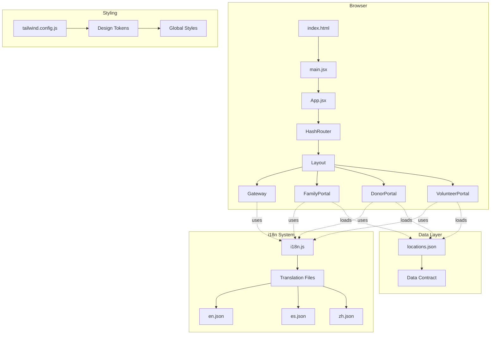
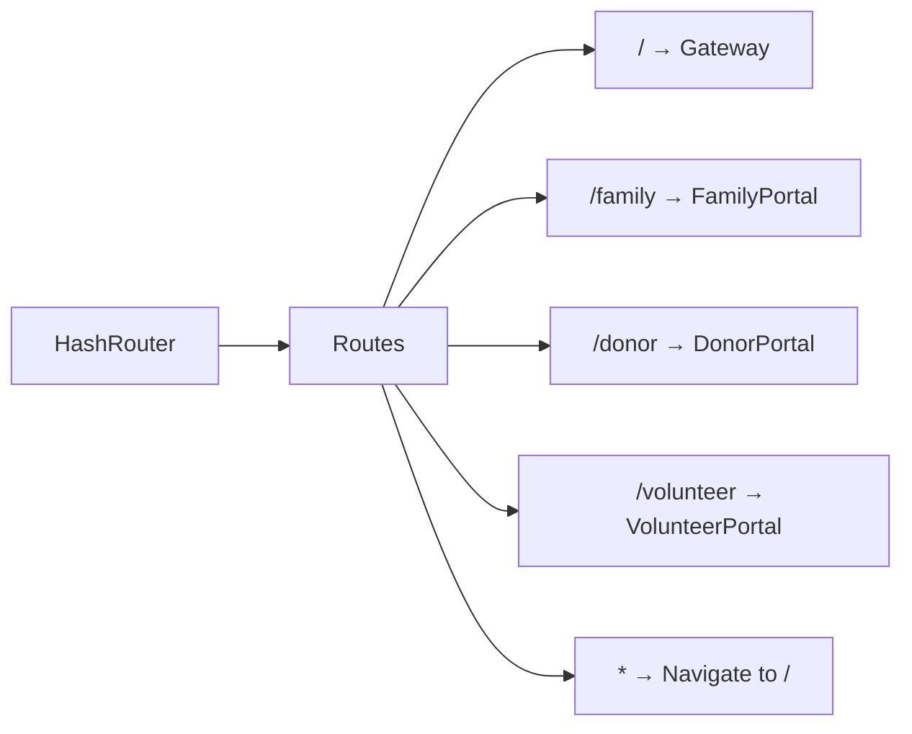
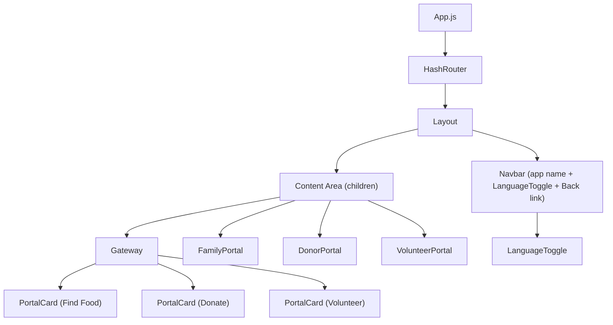

# Design Document — Foundation Setup

## Overview

The Foundation Setup feature establishes the core infrastructure for the NourishNet food access application. This design specifies the technical implementation of routing, internationalization, data contracts, component architecture, styling system, and deployment configuration required to enable parallel development across the team.

### Design Goals

1. **Unblock Parallel Development**: Provide stable interfaces and contracts by Saturday 12:00 PM so all team members can work independently
2. **GitHub Pages Compatibility**: Ensure all routing and build configurations work with static hosting constraints
3. **Mobile-First Accessibility**: Optimize for 375px viewport as the primary target, scaling up to larger screens
4. **Minimal Configuration Overhead**: Use sensible defaults and conventions to reduce setup complexity
5. **Type Safety Through Contracts**: Freeze data schema early to prevent integration issues

### Technology Decisions

| Decision | Choice | Rationale |
|----------|--------|-----------|
| Router | HashRouter (React Router v6) | GitHub Pages doesn't support server-side routing; hash-based routing works without server configuration |
| i18n Library | react-i18next | Industry standard, React-optimized, supports lazy loading and namespaces |
| CSS Framework | Tailwind CSS 4.2.2 | Utility-first approach enables rapid development; v4 has improved performance |
| Build Tool | Create React App 5.0.1 | Already configured; team familiar with tooling; sufficient for hackathon timeline |
| Map Library | Leaflet.js + react-leaflet | Open source requirement; lighter than Google Maps; excellent mobile support |

---

## Architecture

### High-Level System Architecture



### Routing Architecture

The application uses `HashRouter` from React Router DOM v6 for GitHub Pages compatibility. All routes are defined in `src/App.js` (CRA default `.js` extension).



Route definitions in `src/App.js`:

```jsx
import { HashRouter, Routes, Route, Navigate } from 'react-router-dom';
import Layout from './components/christian/Layout';
import Gateway from './components/christian/Gateway';
import FamilyPortal from './pages/FamilyPortal';
import DonorPortal from './pages/DonorPortal';
import VolunteerPortal from './pages/VolunteerPortal';
import './utils/i18n'; // initialize i18n on app load

function App() {
  return (
    <HashRouter>
      <Layout>
        <Routes>
          <Route path="/" element={<Gateway />} />
          <Route path="/family" element={<FamilyPortal />} />
          <Route path="/donor" element={<DonorPortal />} />
          <Route path="/volunteer" element={<VolunteerPortal />} />
          <Route path="*" element={<Navigate to="/" replace />} />
        </Routes>
      </Layout>
    </HashRouter>
  );
}
```

**Key decisions:**
- `HashRouter` wraps the entire app at the top level in `App.js`
- `Layout` sits inside `HashRouter` so it has access to router context (e.g., `useLocation` for hiding "Back to Home" on Gateway)
- Catch-all `*` route redirects to Gateway rather than showing a 404 — simpler UX for a hackathon MVP

---

## Components and Interfaces

### Component Tree



### Component Specifications

#### `Layout` — `src/components/christian/Layout.jsx`

```jsx
/**
 * @param {Object} props
 * @param {React.ReactNode} props.children — page content rendered inside the layout
 */
function Layout({ children }) { ... }
```

Responsibilities:
- Renders a top navbar with: app name/logo (links to `/`), `LanguageToggle`, and a "Back to Home" link
- "Back to Home" link is hidden when the current route is `/` (uses `useLocation()`)
- Renders `{children}` in a main content area below the navbar
- Mobile-first: navbar stacks vertically on small screens, horizontal on `md:` and above
- Navbar has a fixed height; content area fills remaining viewport height

#### `Gateway` — `src/components/christian/Gateway.jsx`

```jsx
/**
 * Landing page with three portal navigation cards.
 * All text uses i18n keys via useTranslation().
 */
function Gateway() { ... }
```

Responsibilities:
- Displays app title (`gateway.title`) and tagline (`gateway.subtitle`)
- Renders three `PortalCard` components in a responsive grid (1 column on mobile, 3 on `md:`)
- Each card links to its portal route using `<Link to="/family">` etc.
- Uses warm, non-stigmatizing language per Requirement 9

#### `PortalCard` — inline in `Gateway.jsx` or `src/components/shared/PortalCard.jsx`

```jsx
/**
 * @param {Object} props
 * @param {string} props.to — route path (e.g., "/family")
 * @param {string} props.icon — emoji or icon identifier
 * @param {string} props.titleKey — i18n key for the card title
 * @param {string} props.descKey — i18n key for the card description
 */
function PortalCard({ to, icon, titleKey, descKey }) { ... }
```

#### `LanguageToggle` — `src/components/christian/LanguageToggle.jsx`

```jsx
/**
 * Renders language selector buttons. Active language is visually highlighted.
 * Persists selection to localStorage under "nourishnet_prefs".
 */
function LanguageToggle() { ... }
```

Responsibilities:
- Renders buttons for "EN" and "ES" (and "ZH" if P1)
- Calls `i18n.changeLanguage(lang)` on click
- Highlights the active language with a distinct background/bold style
- Persists language choice to `localStorage` key `nourishnet_prefs` (merges with existing prefs)
- On mount, reads `nourishnet_prefs.language` from `localStorage` and sets it if present

#### Portal Placeholders — `src/pages/FamilyPortal.jsx`, `DonorPortal.jsx`, `VolunteerPortal.jsx`

```jsx
/**
 * Placeholder portal page. Loads sample data to verify data pipeline.
 * Wrapped in Layout via App.js routing.
 */
function FamilyPortal() { ... }
```

Each portal placeholder:
- Displays portal name and a "Coming soon" message (translated via i18n)
- Imports and renders at least one entry from `locations_sample.json` to verify the data pipeline
- Includes a "Back to Home" link (also available in Layout navbar)

### File Path Summary

| Component | Path |
|-----------|------|
| App (routing) | `src/App.js` |
| Layout | `src/components/christian/Layout.jsx` |
| Gateway | `src/components/christian/Gateway.jsx` |
| LanguageToggle | `src/components/christian/LanguageToggle.jsx` |
| FamilyPortal | `src/pages/FamilyPortal.jsx` |
| DonorPortal | `src/pages/DonorPortal.jsx` |
| VolunteerPortal | `src/pages/VolunteerPortal.jsx` |
| i18n config | `src/utils/i18n.js` |
| English translations | `src/locales/en.json` |
| Spanish translations | `src/locales/es.json` |
| Sample data | `src/data/locations_sample.json` |
| Data schema docs | `src/data/schema.md` |
| Design system docs | `src/styles/DESIGN_SYSTEM.md` |

---

## Data Models

### Location Entry Schema

This is the frozen data contract (Requirement 2). All team members code against this schema.

```typescript
interface LocationEntry {
  id: string;                    // unique identifier
  name: string;                  // organization/event name
  address: string;               // full street address
  city: string;
  state: string;                 // e.g., "MD", "DC", "VA"
  zip: string;
  lat: number;                   // latitude
  lng: number;                   // longitude
  phone: string | null;
  website: string | null;        // URL
  hours: string;                 // human-readable operating hours
  description: string;           // brief description

  food_types: string[];          // e.g., ["Canned Goods", "Fresh Produce"]
  dietary_tags: string[];        // e.g., ["Halal", "Vegan"]

  event_dates: EventDate[];

  requirements: string | null;   // e.g., "Photo ID required"
  serves: string | null;         // e.g., "PG County residents"

  volunteer_needs: {
    accepting_volunteers: boolean;
    roles: string[];             // e.g., ["Food sorting", "Driver"]
    contact: string | null;
  };

  donation_info: {
    accepts_food: boolean;
    accepts_money: boolean;
    accepts_other: string | null;
    dropoff_instructions: string | null;
    donation_url: string | null;
  };

  demand_level: "High" | "Medium" | "Low";
  community_rating: number;      // 1.0 to 5.0
  last_updated: string;          // ISO date
}

interface EventDate {
  day_of_week: string;
  start_time: string;
  end_time: string;
  frequency: "Weekly" | "Biweekly" | "Monthly" | "One-time";
  notes: string | null;
}
```

### User Preferences (localStorage)

Stored under key `"nourishnet_prefs"`:

```typescript
interface UserPreferences {
  language: string;              // "en", "es", "zh"
  role: "family" | "donor" | "volunteer" | null;
  dietary_tags: string[];        // e.g., ["Halal", "Vegan"]
  household_size: number | null;
}
```

Default value on first visit:
```json
{
  "language": "en",
  "role": null,
  "dietary_tags": [],
  "household_size": null
}
```

### Translation File Structure

Translation files use flat dot-notation keys. Example `en.json`:

```json
{
  "gateway.title": "NourishNet",
  "gateway.subtitle": "Connecting communities to food resources in the DC/Maryland area",
  "gateway.familyPortal": "Find Food",
  "gateway.familyPortalDesc": "Discover food pantries, meal programs, and community resources near you",
  "gateway.donorPortal": "Donate",
  "gateway.donorPortalDesc": "Support local food programs with donations of food, funds, or supplies",
  "gateway.volunteerPortal": "Volunteer",
  "gateway.volunteerPortalDesc": "Join missions to help distribute food and support your community",
  "common.loading": "Loading...",
  "common.error": "Something went wrong. Please try again.",
  "common.backToHome": "Back to Home",
  "common.nearMe": "Near Me",
  "common.filter": "Filter",
  "common.search": "Search...",
  "common.noResults": "No results found. Try adjusting your filters.",
  "common.comingSoon": "Coming soon",
  "portal.family.title": "Family Portal",
  "portal.family.placeholder": "This page will show nearby food distribution events.",
  "portal.donor.title": "Donor Portal",
  "portal.donor.placeholder": "This page will show organizations accepting donations.",
  "portal.volunteer.title": "Volunteer Portal",
  "portal.volunteer.placeholder": "This page will show volunteer missions near you."
}
```

### i18n Configuration

`src/utils/i18n.js`:

```javascript
import i18n from 'i18next';
import { initReactI18next } from 'react-i18next';
import en from '../locales/en.json';
import es from '../locales/es.json';

// Read saved language preference
const savedPrefs = JSON.parse(localStorage.getItem('nourishnet_prefs') || '{}');
const savedLang = savedPrefs.language || 'en';

i18n.use(initReactI18next).init({
  resources: {
    en: { translation: en },
    es: { translation: es },
  },
  lng: savedLang,
  fallbackLng: 'en',
  interpolation: { escapeValue: false },
});

export default i18n;
```

**Design decisions:**
- Translations are bundled (imported directly) rather than lazy-loaded — the files are small and this avoids loading flicker
- `fallbackLng: 'en'` ensures missing keys in `es.json` fall back to English rather than showing raw keys
- Language is read from `localStorage` on init so returning users see their preferred language immediately

---

### Tailwind CSS Design System

The `tailwind.config.js` extends the default theme with NourishNet-specific design tokens.

```javascript
/** @type {import('tailwindcss').Config} */
module.exports = {
  content: ["./src/**/*.{js,jsx,ts,tsx}"],
  theme: {
    extend: {
      colors: {
        primary: {
          50:  '#f0fdf4',
          100: '#dcfce7',
          200: '#bbf7d0',
          300: '#86efac',
          400: '#4ade80',
          500: '#22c55e',  // main brand green
          600: '#16a34a',
          700: '#15803d',
          800: '#166534',
          900: '#14532d',
        },
        secondary: {
          50:  '#fff7ed',
          100: '#ffedd5',
          200: '#fed7aa',
          300: '#fdba74',
          400: '#fb923c',
          500: '#f97316',  // warm orange accent
          600: '#ea580c',
        },
        surface: '#f8fafc',    // card/panel backgrounds (slate-50)
        muted:   '#94a3b8',    // subdued text/borders (slate-400)
        danger:  '#ef4444',    // error states (red-500)
        success: '#22c55e',    // positive states (green-500)
      },
      borderRadius: {
        '2xl': '1rem',
      },
      boxShadow: {
        soft: '0 2px 8px 0 rgba(0, 0, 0, 0.08)',
      },
      fontFamily: {
        sans: ['Inter', 'system-ui', '-apple-system', 'sans-serif'],
      },
    },
  },
  plugins: [],
};
```

**Token rationale:**
- `primary` green evokes food, nature, and growth — appropriate for a food access tool
- `secondary` orange provides warm contrast for CTAs and highlights
- `surface` is a near-white for card backgrounds that's softer than pure white
- `shadow-soft` gives cards subtle elevation without heavy drop shadows
- Inter font is clean and highly readable; system font stack as fallback for zero-download performance

### Deployment Configuration

For GitHub Pages deployment with Create React App:

1. Install `gh-pages`: `npm install --save-dev gh-pages`

2. Add to `package.json`:
```json
{
  "homepage": "https://<username>.github.io/<repo-name>",
  "scripts": {
    "predeploy": "npm run build",
    "deploy": "gh-pages -d build"
  }
}
```

3. `HashRouter` ensures all routes work without server-side URL rewriting. URLs look like: `https://<username>.github.io/<repo-name>/#/family`

4. CRA's `build` script outputs to `build/` directory. The `gh-pages` package pushes that directory to the `gh-pages` branch.

**Note:** The requirements mention `vite.config.js` and `base` option, but the project uses Create React App (not Vite). CRA handles the `homepage` field in `package.json` to set the correct asset paths. No `vite.config.js` is needed.


---

## Correctness Properties

*A property is a characteristic or behavior that should hold true across all valid executions of a system — essentially, a formal statement about what the system should do. Properties serve as the bridge between human-readable specifications and machine-verifiable correctness guarantees.*

### Property 1: Defined routes render correct components

*For any* route in the defined route table (`/`, `/family`, `/donor`, `/volunteer`), navigating to that route should render the component mapped to it and no other portal component.

**Validates: Requirements 1.3, 13.2**

### Property 2: Undefined routes redirect to Gateway

*For any* URL path string that is not one of the defined routes (`/`, `/family`, `/donor`, `/volunteer`), navigating to it should redirect the user to the Gateway page at `/`.

**Validates: Requirements 1.4**

### Property 3: LocationEntry schema conformance and null-safety

*For any* LocationEntry object (including entries where optional fields are `null`), the entry should conform to the data contract schema (all required fields present with correct types) AND rendering the entry in a portal component should not throw an error.

**Validates: Requirements 2.4, 2.6**

### Property 4: Translation key parity and format

*For any* key present in `en.json`, that key should also exist in `es.json` with a non-empty string value, AND the key should follow dot-notation namespacing format (e.g., `"section.key"`).

**Validates: Requirements 3.7, 4.4**

### Property 5: Language switch updates all translations

*For any* supported language and *any* i18n key defined in that language's translation file, after calling `i18n.changeLanguage(lang)`, the `t(key)` function should return the value from that language's translation file (not the fallback language).

**Validates: Requirements 5.4**

### Property 6: Language preference persistence round-trip

*For any* supported language code, selecting that language via the LanguageToggle should persist the choice to `localStorage` under `nourishnet_prefs.language`, such that reading `localStorage` and parsing the stored JSON returns the same language code.

**Validates: Requirements 5.7**

### Property 7: User preferences localStorage round-trip

*For any* valid `UserPreferences` object (with `language` as a string, `role` as one of `"family" | "donor" | "volunteer" | null`, `dietary_tags` as a string array, and `household_size` as a number or null), serializing it to `localStorage` under key `"nourishnet_prefs"` and then reading it back should produce an equivalent object with all required fields intact.

**Validates: Requirements 12.1, 12.2**

---

## Error Handling

### Data Loading Errors

- If `locations.json` or `locations_sample.json` fails to load (malformed JSON, missing file), the portal pages should display the `common.error` translated message rather than crashing
- Null optional fields in LocationEntry objects are expected and must not cause rendering errors — components should use fallback values (e.g., "N/A" for null phone numbers, empty arrays for missing dietary_tags)

### i18n Errors

- Missing translation keys fall back to English via `fallbackLng: 'en'` — the app never shows raw key strings like `"gateway.title"`
- If `localStorage` contains invalid JSON for `nourishnet_prefs`, the i18n system should catch the parse error and default to English

### Routing Errors

- Any unmatched route redirects to Gateway via the catch-all `*` route — no 404 pages
- If a portal component fails to render, React's default error boundary behavior applies (white screen). For MVP, this is acceptable; a custom error boundary is a P2 enhancement

### localStorage Errors

- If `localStorage` is unavailable (private browsing in some browsers), preference persistence should fail silently — the app works without saved preferences
- Reading malformed JSON from `localStorage` should be wrapped in try/catch with fallback to defaults

---

## Testing Strategy

### Testing Framework

The project uses Create React App's built-in testing setup:
- **Jest** as the test runner (via `react-scripts test`)
- **@testing-library/react** for component rendering and interaction
- **@testing-library/jest-dom** for DOM assertions
- **@testing-library/user-event** for simulating user interactions

### Property-Based Testing

Property-based testing is applicable to this feature for the data validation, i18n key parity, and localStorage round-trip properties. The recommended library is **fast-check** for JavaScript/React projects.

- Install: `npm install --save-dev fast-check`
- Each property test runs a minimum of 100 iterations
- Each property test is tagged with a comment referencing the design property:
  ```javascript
  // Feature: foundation-setup, Property 1: Defined routes render correct components
  ```
- Tag format: **Feature: foundation-setup, Property {number}: {property_text}**

### Unit Tests (Example-Based)

| Test Area | What to Test | Priority |
|-----------|-------------|----------|
| Router setup | HashRouter is used, 4 routes defined | P0 |
| Gateway rendering | 3 portal cards with correct labels, tagline | P0 |
| LanguageToggle | EN/ES buttons render, click changes language, active state highlighted | P0 |
| Layout | Children render, navbar present, "Back to Home" hidden on `/` | P0 |
| Portal placeholders | Each portal renders name + placeholder message + sample data | P0 |
| i18n init | Defaults to English, loads both locale files | P0 |
| Tailwind config | Semantic colors, shadow-soft, rounded-2xl defined | P1 |

### Property Tests

| Property | Generator Strategy | Iterations |
|----------|-------------------|------------|
| P1: Route-component mapping | Enumerate all 4 defined routes | 100 |
| P2: Undefined route redirect | Generate random alphanumeric path strings | 100 |
| P3: LocationEntry schema + null-safety | Generate LocationEntry objects with random null combinations for optional fields | 100 |
| P4: Translation key parity + format | Read all keys from en.json, verify each in es.json | 100 |
| P5: Language switch translations | For each language × each key, verify t() output | 100 |
| P6: Language preference round-trip | Generate random language codes from supported set | 100 |
| P7: Preferences round-trip | Generate random UserPreferences objects | 100 |

### Smoke Tests

| Test | What to Verify |
|------|---------------|
| App renders | No console errors on initial render |
| Build succeeds | `npm run build` exits with code 0 |
| Directory structure | Expected folders exist under `src/` |
| Package dependencies | react-router-dom, i18next, react-i18next, tailwindcss in package.json |
