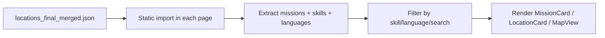

# Design Document: Volunteer Portal

## Overview

The Volunteer Portal is a multi-page experience within NourishNet that enables volunteers to discover, browse, filter, and sign up for food assistance missions across Prince George's County. It mirrors the established Customer and Donor portal patterns — a landing page with horizontal-scroll featured sections, dedicated browse/filter pages, an interactive Leaflet map view, detail pages, search with voice support, and full i18n across 6 languages.

Because only 3 of 737 locations currently have mission data, the feature also includes a Node.js data enrichment script that generates realistic mission records for 150+ additional locations, ensuring the portal is meaningful at launch.

### Key Design Decisions

1. **Follow existing portal patterns exactly**: The volunteer pages use `SearchHeader`, `FilterBar`, `LocationCard`, and `MapView` — the same shared components used by Customer and Donor portals. New pages live in `src/UI/` (not `src/pages/`) and use the same CSS class naming conventions (`vol-*` prefix, matching `cust-*` and `donor-*`).

2. **Data enrichment via offline Node.js script**: A one-time script reads `locations_final_merged.json`, enriches locations with generated missions, and writes the file back. This avoids runtime generation and keeps the data static for the GitHub Pages deployment.

3. **Skill/Language filter dimensions replace Food/Health filters**: Where Customer and Donor portals filter by `foodTypes` and `healthAttributes`, the Volunteer portal filters by `skillsRequired` and `languagesNeeded` from mission data. The `FilterBar` component is extended (or a `VolunteerFilterBar` variant is created) to support these new filter dimensions.

4. **Urgency derived from existing `insecurityIndex`**: No new data field is needed. Locations with `insecurityIndex` 4–5 are flagged as urgent/high-need using color-coded badges, consistent with the Donor portal's existing urgency display.

5. **Routes registered directly in App.js without Layout wrapper**: Matching the Customer (`/customer/*`) and Donor (`/donor/*`) patterns, volunteer routes use `SearchHeader` directly rather than the `Layout` component wrapper that the old `VolunteerPortal` page used.

## Architecture

```mermaid
graph TD
    A[App.js Router] --> B[/volunteer - VolunteerPage]
    A --> C[/volunteer/missions - VolunteerMissionsPage]
    A --> D[/volunteer/skill/:skillName - VolunteerSkillDetailPage]
    A --> E[/volunteer/language/:languageName - VolunteerLanguageDetailPage]
    A --> F[/volunteer/map - VolunteerMapPage]
    A --> G[/volunteer/search - VolunteerSearchResultsPage]

    B --> SH[SearchHeader]
    C --> SH
    D --> SH
    E --> SH
    F --> SH
    G --> SH

    B --> LC[LocationCard]
    C --> MC[MissionCard]
    D --> MC
    E --> MC
    F --> MV[MapView]
    G --> MC

    C --> VFB[VolunteerFilterBar]
    F --> VFB
```

### Component Hierarchy

```
App.js (HashRouter)
├── /volunteer → VolunteerPage
│   ├── SearchHeader (backTo="/portal", navPrefix="/volunteer")
│   ├── Hero Section
│   ├── Urgent Missions (horizontal scroll of MissionCard)
│   ├── Nearby Opportunities (horizontal scroll of location cards)
│   ├── Browse by Skill (horizontal scroll of pill cards)
│   └── Browse by Language (horizontal scroll of pill cards)
├── /volunteer/missions → VolunteerMissionsPage
│   ├── SearchHeader
│   ├── VolunteerFilterBar (skills, languages, sort)
│   └── MissionCard list
├── /volunteer/skill/:skillName → VolunteerSkillDetailPage
│   ├── SearchHeader
│   └── MissionCard list (filtered by skill)
├── /volunteer/language/:languageName → VolunteerLanguageDetailPage
│   ├── SearchHeader
│   └── MissionCard list (filtered by language)
├── /volunteer/map → VolunteerMapPage
│   ├── SearchHeader (activeNav="map")
│   ├── Sidebar with VolunteerFilterBar + range slider
│   └── MapView with urgency-colored markers
└── /volunteer/search → VolunteerSearchResultsPage
    ├── SearchHeader
    └── Results grouped by location with nested MissionCards
```

### Data Flow



## Components and Interfaces

### 1. Data Enrichment Script (`scripts/enrich-missions.js`)

A Node.js script that runs once to populate mission data across locations.

```js
/**
 * Reads locations_final_merged.json, generates missions for locations
 * with empty missions arrays, and writes the enriched data back.
 *
 * - Prioritizes locations with insecurityIndex 4-5
 * - Generates 1-3 missions per location
 * - Assigns skills from a pool of 8+, languages from a pool of 6+
 * - Sets volunteersNeeded (1-20) for each enriched location
 * - Produces at least 150 newly enriched locations
 */
```

**Skill Pool** (minimum 8):
`"Food Handling"`, `"Driving"`, `"Translation"`, `"Sorting"`, `"Cooking"`, `"Outreach"`, `"Data Entry"`, `"Childcare"`, `"Warehouse"`, `"Event Setup"`

**Language Pool** (minimum 6):
`"English"`, `"Spanish"`, `"Chinese"`, `"French"`, `"Amharic"`, `"Tagalog"`

**Mission Title Templates**: Drawn from a pool of ~15 realistic titles (e.g., "Food Distribution Assistant", "Mobile Pantry Driver", "Community Outreach Coordinator", "Meal Prep Volunteer").

**Date Generation**: Dates within the next 90 days from script execution.

### 2. VolunteerPage (`src/UI/VolunteerPage.jsx`)

The landing page at `/volunteer`. Mirrors `CustomerPage.jsx` and `DonorPage.jsx` structure.

```jsx
/**
 * Volunteer portal landing page with hero section and horizontal-scroll
 * featured sections for urgent missions, nearby opportunities,
 * browse by skill, and browse by language.
 *
 * @uses SearchHeader - backTo="/portal", activeNav="home", navPrefix="/volunteer"
 * @uses MissionCard - for urgent missions section
 * @uses useScrollDrag - for horizontal scroll interaction
 */
function VolunteerPage() { ... }
```

**Sections:**
1. **Hero** — Translated title (`volunteerPortal.title`) and subtitle (`volunteerPortal.subtitle`)
2. **Urgent Missions** — Horizontal scroll of `MissionCard` components from locations with `insecurityIndex >= 4`, sorted descending. Arrow navigates to `/volunteer/missions?sort=urgency`.
3. **Nearby Opportunities** — Horizontal scroll of location cards (locations with missions). Arrow navigates to `/volunteer/missions`.
4. **Browse by Skill** — Pill-style cards for each unique skill. Click navigates to `/volunteer/skill/{skillName}`. Arrow navigates to `/volunteer/missions`.
5. **Browse by Language** — Pill-style cards for each unique language. Click navigates to `/volunteer/language/{languageName}`. Arrow navigates to `/volunteer/missions`.

### 3. MissionCard (`src/UI/MissionCard.jsx`)

A reusable card component for displaying a single mission with its parent location context.

```jsx
/**
 * Displays a mission's title, description, date, required skills (badges),
 * needed languages (badges), urgency badge, parent location info,
 * volunteersNeeded count, and a Sign Up CTA.
 *
 * @param {Object} props
 * @param {Object} props.mission - Mission object {title, description, date, skillsRequired[], languagesNeeded[]}
 * @param {Object} props.location - Parent location object
 * @param {Function} [props.onSignUp] - Callback when Sign Up is clicked
 */
function MissionCard({ mission, location, onSignUp }) { ... }
```

**Urgency Badge Logic:**
- `insecurityIndex === 5` → Red "🔴 Critical" badge
- `insecurityIndex === 4` → Orange "🟠 High Need" badge
- `insecurityIndex <= 3` → Green/neutral indicator (or no badge)

### 4. VolunteerFilterBar (`src/UI/VolunteerFilterBar.jsx`)

A filter panel adapted from `FilterBar.jsx` but with skill and language filter dimensions instead of food/health.

```jsx
/**
 * Collapsible filter/sort panel with skill pills, language pills,
 * and sort options (urgency, name).
 *
 * @param {Object} props
 * @param {string[]} props.allSkills - All unique skill values
 * @param {string[]} props.allLanguages - All unique language values
 * @param {Function} props.onFilter - Callback with {skills: Set, languages: Set, sort: string}
 * @param {number} props.totalCount - Total mission count before filtering
 * @param {number} props.filteredCount - Mission count after filtering
 */
function VolunteerFilterBar({ allSkills, allLanguages, onFilter, totalCount, filteredCount }) { ... }
```

**Sort Options:** `"urgency"` (insecurityIndex descending, default), `"name"` (alphabetical by location name)

### 5. VolunteerMissionsPage (`src/UI/VolunteerMissionsPage.jsx`)

Full mission listing at `/volunteer/missions`. Mirrors `DonorNeedsPage.jsx` pattern.

```jsx
/**
 * Browse all missions with skill/language filters and sort.
 * Displays SearchHeader, VolunteerFilterBar, result count, and MissionCard list.
 */
function VolunteerMissionsPage() { ... }
```

**Filter Logic:**
- Skill filter: Show missions where `skillsRequired` contains at least one selected skill
- Language filter: Show missions where `languagesNeeded` contains at least one selected language
- Combined: AND logic — mission must match at least one selected skill AND at least one selected language
- Search: Matches against location name, mission title, mission description, skills, languages

### 6. VolunteerSkillDetailPage (`src/UI/VolunteerSkillDetailPage.jsx`)

Detail page at `/volunteer/skill/:skillName`. Shows all missions requiring a specific skill.

```jsx
/**
 * Displays all missions requiring the specified skill,
 * with parent location information and MissionCard rendering.
 *
 * @route /volunteer/skill/:skillName
 */
function VolunteerSkillDetailPage() { ... }
```

### 7. VolunteerLanguageDetailPage (`src/UI/VolunteerLanguageDetailPage.jsx`)

Detail page at `/volunteer/language/:languageName`. Shows all missions needing a specific language.

```jsx
/**
 * Displays all missions needing the specified language,
 * with parent location information and MissionCard rendering.
 *
 * @route /volunteer/language/:languageName
 */
function VolunteerLanguageDetailPage() { ... }
```

### 8. VolunteerMapPage (`src/UI/VolunteerMapPage.jsx`)

Full-page map view at `/volunteer/map`. Mirrors `DonorMapPage.jsx` pattern.

```jsx
/**
 * Interactive map showing locations with missions.
 * Includes sidebar with skill/language filters and range slider.
 * Markers are color-coded by urgency level.
 *
 * @uses SearchHeader - activeNav="map", navPrefix="/volunteer"
 * @uses MapContainer, TileLayer, Marker, Popup from react-leaflet
 * @uses VolunteerFilterBar (sidebar variant)
 */
function VolunteerMapPage() { ... }
```

**Marker Colors:**
- `insecurityIndex === 5` → Red marker
- `insecurityIndex === 4` → Orange marker
- `insecurityIndex <= 3` → Green marker

**Popup Content:** Location name, address, mission count, urgency level, "Get Directions" link.

**Sidebar:** Skill filter pills, language filter pills, location range slider (5mi, 10mi, 20mi, 55mi), clear filters button.

**Detail Card:** Below the map, shows selected location info, mission list, and prev/next navigation arrows (matching `DonorMapPage` pattern).

### 9. VolunteerSearchResultsPage (`src/UI/VolunteerSearchResultsPage.jsx`)

Search results at `/volunteer/search?q={query}`. Mirrors `SearchResultsPage.jsx` pattern.

```jsx
/**
 * Displays search results grouped by parent location,
 * with nested MissionCards for matching missions.
 *
 * @route /volunteer/search?q={query}
 */
function VolunteerSearchResultsPage() { ... }
```

**Search Matching:** Query matches against location name, mission title, mission description, skill names, and language names.

### 10. Route Registration (App.js modifications)

New routes added to `App.js`:

```jsx
{/* Volunteer Portal */}
<Route path="/volunteer" element={<VolunteerPage />} />
<Route path="/volunteer/missions" element={<VolunteerMissionsPage />} />
<Route path="/volunteer/skill/:skillName" element={<VolunteerSkillDetailPage />} />
<Route path="/volunteer/language/:languageName" element={<VolunteerLanguageDetailPage />} />
<Route path="/volunteer/map" element={<VolunteerMapPage />} />
<Route path="/volunteer/search" element={<VolunteerSearchResultsPage />} />
```

The existing `<Route path="/volunteer" element={<Layout><VolunteerPortal /></Layout>} />` is replaced. The old `VolunteerPortal.jsx` in `src/pages/` is no longer used by the router.

## Data Models

### Mission Object (within location JSON)

```ts
type Mission = {
  title: string;           // e.g., "Food Distribution Assistant"
  description: string;     // e.g., "Help sort and distribute food packages..."
  skillsRequired: string[]; // e.g., ["Food Handling", "Sorting"]
  languagesNeeded: string[]; // e.g., ["English", "Spanish"]
  date: string;            // e.g., "2025-09-15"
};
```

### Location (relevant fields for volunteer portal)

```ts
type Location = {
  id: string;
  name: string;
  address: { street: string; city: string; state: string; zip: string };
  lat: number;
  lng: number;
  hours: string;
  phone: string;
  website: string;
  insecurityIndex: number;  // 1-5 scale
  missions: Mission[];
  volunteersNeeded: number | null;
  foodTypes: string[];
  healthAttributes: Record<string, boolean>;
};
```

### Urgency Level Mapping

```ts
function getUrgencyLevel(insecurityIndex: number): { label: string; color: string; emoji: string } {
  if (insecurityIndex === 5) return { label: 'Critical', color: '#ef4444', emoji: '🔴' };
  if (insecurityIndex === 4) return { label: 'High Need', color: '#f97316', emoji: '🟠' };
  if (insecurityIndex === 3) return { label: 'Moderate', color: '#eab308', emoji: '🟡' };
  return { label: 'Standard', color: '#22c55e', emoji: '🟢' };
}
```

### Filter State

```ts
type VolunteerFilterState = {
  skills: Set<string>;
  languages: Set<string>;
  sort: 'urgency' | 'name';
};
```

### Flattened Mission (for listing/filtering)

Pages that list missions flatten the nested structure for easier filtering:

```ts
type FlatMission = {
  mission: Mission;
  location: Location;
  urgencyLevel: number; // from location.insecurityIndex
};
```

### i18n Keys (added to `volunteerPortal` namespace)

```json
{
  "volunteerPortal": {
    "title": "Volunteer Portal",
    "subtitle": "Find missions and help distribute food in your area",
    "urgentMissions": "Urgent Missions",
    "nearbyOpportunities": "Nearby Opportunities",
    "browseBySkill": "Browse by Skill",
    "browseByLanguage": "Browse by Language",
    "allMissions": "All Missions",
    "missionsAt": "Missions at {{name}}",
    "skillsRequired": "Skills Required",
    "languagesNeeded": "Languages Needed",
    "volunteersNeeded": "Volunteers Needed",
    "signUp": "Sign Up",
    "critical": "Critical",
    "highNeed": "High Need",
    "moderate": "Moderate",
    "standard": "Standard",
    "sortByUrgency": "Sort by Urgency",
    "sortByName": "Sort by Name",
    "missionCount": "{{count}} missions",
    "filterBySkill": "Filter by Skill",
    "filterByLanguage": "Filter by Language"
  }
}
```


## Correctness Properties

*A property is a characteristic or behavior that should hold true across all valid executions of a system — essentially, a formal statement about what the system should do. Properties serve as the bridge between human-readable specifications and machine-verifiable correctness guarantees.*

### Property 1: Enriched mission schema validity

*For any* mission in the enriched dataset, the mission SHALL have a non-empty `title`, a non-empty `description`, at least one entry in `skillsRequired`, at least one entry in `languagesNeeded`, a non-empty `date` string, and its parent location SHALL have `volunteersNeeded` as an integer between 1 and 20 (inclusive).

**Validates: Requirements 1.2, 1.5**

### Property 2: High-need locations receive missions

*For any* location with `insecurityIndex` of 4 or 5, the enriched dataset SHALL contain at least one mission for that location (i.e., `missions.length >= 1`).

**Validates: Requirements 1.4**

### Property 3: Urgency level mapping consistency

*For any* location, the urgency badge color and label SHALL be determined solely by `insecurityIndex`: index 5 maps to red/"Critical", index 4 maps to orange/"High Need", index 3 or below maps to green/neutral. This mapping SHALL be consistent across MissionCard badges, map marker colors, and detail view badges.

**Validates: Requirements 4.2, 5.5, 9.1, 9.2, 9.3**

### Property 4: Urgent missions section contains only high-need missions

*For any* set of locations, the "Urgent Missions" section on the landing page SHALL contain only missions from locations with `insecurityIndex >= 4`, and they SHALL be sorted by `insecurityIndex` descending.

**Validates: Requirements 2.3, 9.4**

### Property 5: Skill and language filter correctness

*For any* combination of selected skills and selected languages applied to any set of missions: when only skills are selected, all displayed missions SHALL have at least one skill in common with the selection; when only languages are selected, all displayed missions SHALL have at least one language in common with the selection; when both are selected, all displayed missions SHALL match at least one selected skill AND at least one selected language.

**Validates: Requirements 3.2, 3.3, 3.4**

### Property 6: Search result relevance

*For any* non-empty search query and any set of missions/locations, every result returned by the volunteer search SHALL have the query substring matching at least one of: location name, mission title, mission description, a skill name in `skillsRequired`, or a language name in `languagesNeeded` (case-insensitive).

**Validates: Requirements 6.1**

### Property 7: MissionCard renders all required fields

*For any* valid mission object with a parent location, the MissionCard component SHALL render the mission title, description, date, every entry in `skillsRequired` as a badge, every entry in `languagesNeeded` as a badge, and the urgency badge corresponding to the location's `insecurityIndex`.

**Validates: Requirements 5.1**

### Property 8: Default sort order is urgency descending

*For any* list of missions displayed on the browse page with default sort, the missions SHALL be ordered by their parent location's `insecurityIndex` descending (highest urgency first).

**Validates: Requirements 9.5**

## Error Handling

| Scenario | Behavior | User Impact |
|----------|----------|-------------|
| Location has empty `missions` array | Location excluded from volunteer portal listings and map markers | User only sees locations with available missions |
| Mission has missing/null `skillsRequired` or `languagesNeeded` | Treated as empty array `[]`; mission still displayed but won't match skill/language filters | Mission visible in unfiltered view but not discoverable via filters |
| `insecurityIndex` is null or undefined | Defaults to 0; treated as low urgency (green/neutral badge) | Location appears with standard priority |
| Search query returns no results | Display "No results found" message with the query text | User sees clear feedback, can modify search |
| Map fails to load (Leaflet error) | Show fallback message; list view remains functional | User can still browse missions via list pages |
| Voice search not supported by browser | Alert user with translated message (existing SearchHeader behavior) | User falls back to text search |
| Location has invalid lat/lng (null/NaN) | Excluded from map markers; still appears in list views | No map marker but mission is still discoverable |
| Enrichment script encounters read/write error | Script exits with error message and non-zero exit code | Developer re-runs script after fixing file permissions |

## Testing Strategy

### Unit Tests (Example-Based)

Unit tests cover specific rendering, navigation, and integration scenarios:

- **VolunteerPage rendering**: Verify hero section, all four horizontal-scroll sections, SearchHeader props, and section arrow navigation targets
- **MissionCard rendering**: Verify all fields render for a concrete mission/location pair; verify Sign Up button is present
- **VolunteerFilterBar**: Verify skill/language pills render, toggle state works, clear filters resets state
- **Route registration**: Verify all 6 volunteer routes are in App.js and render without errors
- **Search results grouping**: Verify results are grouped by parent location with nested mission cards
- **i18n keys**: Verify `volunteerPortal.*` keys exist in en.json and are used via `t()` in components
- **Deep linking**: Verify direct navigation to each volunteer route renders the correct page

### Property-Based Tests

Property-based tests use **fast-check** (already available in the project's test ecosystem via Jest) to verify universal properties across generated inputs. Each test runs a minimum of 100 iterations.

Properties to implement:
1. **Enriched mission schema** — Generate random subsets of the enriched data and verify schema invariants (Property 1)
2. **High-need location coverage** — Verify all insecurityIndex 4-5 locations have missions (Property 2)
3. **Urgency mapping** — Generate random insecurityIndex values (1-5) and verify correct color/label output (Property 3)
4. **Urgent section filtering** — Generate random location sets and verify only insecurityIndex >= 4 appear, sorted descending (Property 4)
5. **Skill/language filter** — Generate random skill/language selections and mission sets, verify filter output correctness (Property 5)
6. **Search relevance** — Generate random queries and mission/location data, verify all results contain the query in a valid field (Property 6)
7. **MissionCard completeness** — Generate random mission objects and verify all fields appear in rendered output (Property 7)
8. **Default sort order** — Generate random mission lists and verify urgency-descending sort (Property 8)

**Tag format**: Each property test is tagged with a comment:
```
// Feature: volunteer-portal, Property {N}: {property_text}
```

### Integration Tests

- **Language switching**: Render volunteer page, switch language via LanguagePopover, verify text updates
- **Voice search**: Mock Web Speech API, trigger microphone button, verify search executes
- **End-to-end navigation flow**: Portal page → Volunteer landing → Browse missions → Filter → Map → Search
